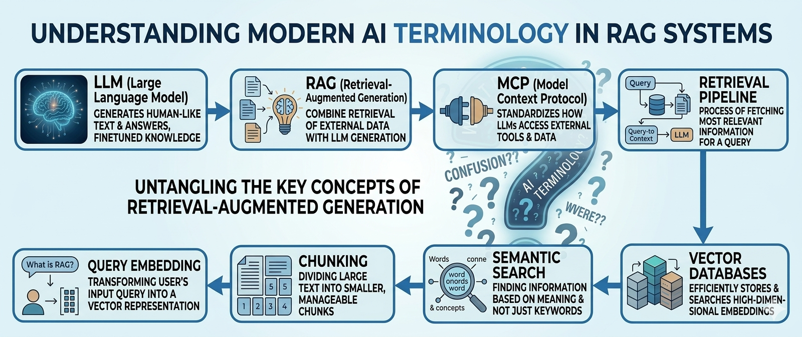
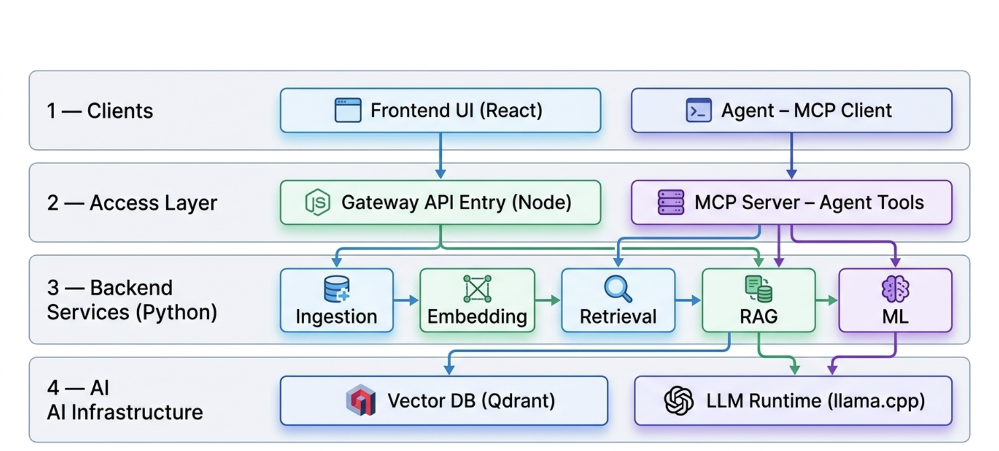
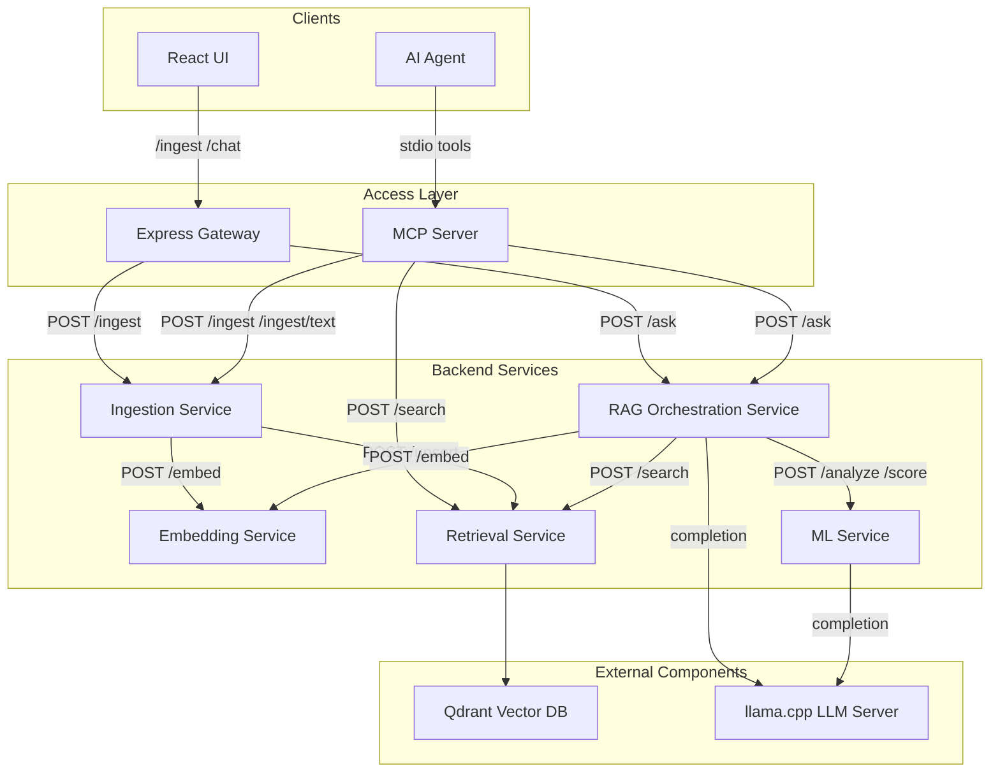
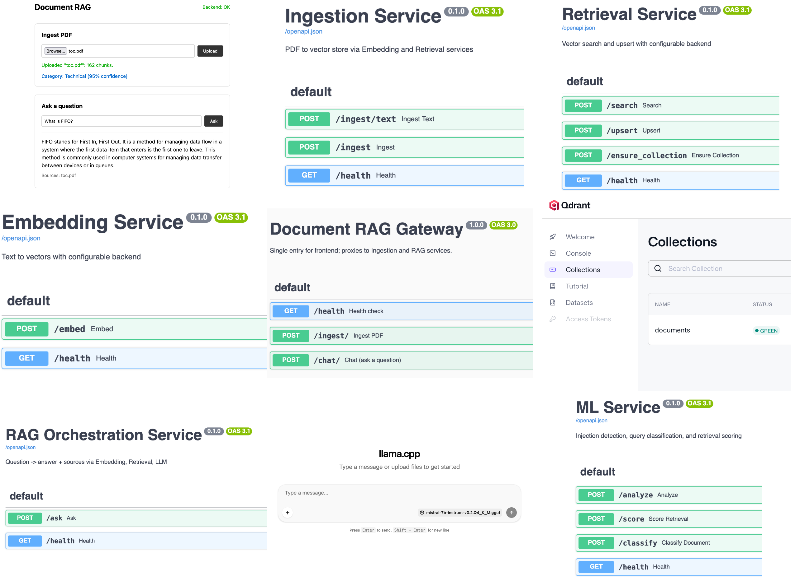

# Document RAG AI 📚🤖



A **local-first Retrieval-Augmented Generation (RAG) platform** for document question answering.

Upload PDF documents, ask questions, and receive answers grounded in your documents, all running **locally with no external API keys required** by default.

This project is designed as a small AI platform rather than a single demo script: it includes ingestion, chunking, embeddings, vector search, reranking, query rewriting, answer generation, source attribution, and optional LLM-based analysis. The system is built with a **service-oriented architecture** and **pluggable AI backends** so core components can be swapped without changing the public APIs.

## Table of contents 🧭

* [Why This Project Stands Out](#why-this-project-stands-out)
* [Demo Guide](#demo-guide)
* [Features](#features)
* [Local AI Stack](#local-ai-stack)
* [Implemented vs Planned](#implemented-vs-planned)
* [Architecture](#architecture)
* [Prerequisites](#prerequisites)
* [Quick Start](#quick-start)
* [Local Development](#local-development)
* [API Endpoints](#api-endpoints)
* [Configuration](#configuration)
* [Development](#development)
* [Project Policies](#project-policies)
* [Troubleshooting](#troubleshooting)
* [Project Structure](#project-structure)
* [Security and Safeguards](#security-and-safeguards)
* [Roadmap and Future Improvements](#roadmap-and-future-improvements)
* [License](#license)



*[↑ Full Architecture section](#architecture)*

## Why This Project Stands Out 🚀

* Runs fully local by default with `sentence-transformers`, Qdrant, and `llama.cpp`
* Implements a complete end-to-end RAG pipeline instead of simple prompt forwarding
* Includes practical quality layers such as query rewriting, reranking, safeguards, and optional ML analysis
* Uses a modular multi-service architecture with config-driven backends
* Exposes the same platform through a React UI, Gateway API, and MCP tools for AI agents
* Demonstrates full-stack delivery with FastAPI services, Express Gateway, Docker workflow, CI, and local development docs

## Demo Guide 🎬

See [docs/demo.md](docs/demo.md). It includes a short demo flow, sample prompts, and what to point out when presenting the project.

For a long-form engineering walkthrough written as an article, see [docs/ARTICLE.md](docs/ARTICLE.md).

For the full documentation map, see [docs/README.md](docs/README.md).

---

# Features ✨

### Core RAG workflow 🧠

* PDF document ingestion for searchable knowledge bases
* Raw text ingestion for automation and MCP-driven workflows
* Semantic retrieval with embeddings and vector search
* Grounded answer generation with source attribution
* Local-first question answering with no external API keys required by default

### Retrieval quality 🎯

* Optional query rewriting for short or vague user questions
* Optional BGE reranking for better context selection
* Configurable retrieval depth such as `TOP_K`, `VECTOR_SEARCH_TOP_K`, and `RERANK_TOP_K`

### Safety and analysis 🛡️

* Configurable input safeguards for prompt injection and blocked topics
* Configurable output safeguards for sensitive or disallowed responses
* Optional ML service for prompt injection detection, query classification, retrieval scoring, and document classification

### Platform architecture 🏗️

* Multi-service monorepo with clear service boundaries
* Python `FastAPI` backend services for ingestion, embedding, retrieval, RAG, and ML
* Express + TypeScript Gateway for frontend-facing API access
* React frontend for upload and chat workflows
* MCP server so AI agents can search, ask questions, and ingest content as tools

### Extensibility 🔌

* Config-driven backends for embeddings, vector databases, and LLM providers
* Default local stack with `sentence-transformers`, Qdrant, and `llama.cpp`
* Alternative and extensible backends including `pgvector`, `openai`, and Bedrock-oriented extension points

### Developer experience 💻

* Docker workflow for running the stack locally
* Local development guide for running services individually
* OpenAPI docs exposed by the Gateway
* Tests, linting, CI, contributing guide, and security policy

## Local AI Stack 🧱

The default stack runs fully locally:

| Component       | Technology                 |
| --------------- | -------------------------- |
| Embeddings      | `BAAI/bge-small-en-v1.5`   |
| Vector Database | Qdrant                     |
| LLM             | Mistral 7B via `llama.cpp` |

No external API keys required.

## Implemented vs Planned 📌

| Area | Implemented now | Planned / future |
| ---- | --------------- | ---------------- |
| Ingestion | PDF ingestion, raw text ingestion, chunking, embedding, vector upsert | More ingestion formats and richer preprocessing |
| Retrieval | Embeddings, Qdrant search, source attribution | Hybrid retrieval (vector + keyword) |
| Retrieval quality | Query rewriting, optional BGE reranking | More advanced rerankers and query routing |
| Safety and ML | Input safeguards, output safeguards, optional ML analysis and scoring | Stronger moderation, richer policy controls, deeper evaluation |
| LLM backends | `llama.cpp` and `openai` backends, Bedrock placeholders | Additional production-ready provider backends |
| Vector backends | `qdrant` and `pgvector` | More vector store providers if needed |
| Interfaces | React UI, Gateway API, MCP server tools | Broader agent workflows and external tool orchestration |
| Platform operations | Docker workflow, local development docs, tests, linting, OpenAPI docs | Observability, tracing, and multi-tenant support |

---

# Architecture 🏛️

The system uses a **service-based RAG architecture** where each service is responsible for a specific part of the AI pipeline.




For service APIs, repository layout, data flow, and MCP integration, see [docs/architecture.md](docs/architecture.md).

For config-driven provider backends and extension points, see [docs/backends.md](docs/backends.md).

---

# Prerequisites ✅

* Python **3.11+**
* Node.js **18+** (frontend and Gateway)
* Docker (for Qdrant)
* [llama.cpp](https://github.com/ggerganov/llama.cpp) server with a **Mistral 7B GGUF model**
* [Qdrant](https://qdrant.tech/documentation/quick-start/) (vector database; runs in Docker)

---

# Quick Start ⚡

## First-time setup (after clone) 🆕

Do these **once** after cloning the repo:

1. **Optional:** Copy the env template: `cp .env.example .env` (see [Optional configuration](#optional-configuration) below if you need to override defaults).
2. **Local LLM:** Run `make init-llama`, then download a GGUF model and place it in `models/`. See [models/README.md](models/README.md) for the default filename and download link.
3. Then follow the steps below to start the backend, LLM, and frontend.

## Optional configuration ⚙️

If you want to override defaults, create a repo-wide env file first:

```bash
cp .env.example .env
```

Both Docker Compose and the Python backend services read the root `.env`. If you are happy with the defaults, you can skip this step.

## Start backend services 🧩

From the project root:

```bash
make up
```

This starts Gateway, Ingestion, Embedding, Retrieval, RAG, ML, and Qdrant in Docker. Data persists in the `qdrant_data` volume. Set `LLM_URL` if your llama.cpp server is not at `http://localhost:8080` (e.g. on Mac/Windows use `LLM_URL=http://host.docker.internal:8080`).

## Start the LLM 🤖

In another terminal, run the LLM on your host (required for chat):

If this is your first run, set up the local LLM runtime once with `make init-llama` and place a GGUF model in `models/`. See [models/README.md](models/README.md) for the expected filename and alternatives.

```bash
make llm
```

## Start the frontend 🖥️

```bash
make frontend
```

Open **http://localhost:5173**. The Gateway API is at **http://localhost:8000**.

When everything is up and running locally, it looks like this:



To rebuild images after code changes: `make build` then `make up`. To stop containers but keep data: `make down`. To remove containers and the volume: `make down-vol`.

---

# Local Development 💻

Run services on your machine with **only Qdrant in Docker**. The Gateway runs in Node.js; the other backend services run in Python.

**First-time setup:** Create the backend virtual environment and install dependencies (see [Local development](docs/local-development.md) → “Backend Python environment”). Without this, `make run-backends` will fail with “venv/bin/uvicorn: No such file or directory”.

**Order:**

```bash
make qdrant
make run-embedding
make run-retrieval
make run-ingestion
make run-rag
make run-ml   # optional when ML_SERVICE_ENABLED=true
make run-gateway
make llm
make frontend
```

For the full step-by-step, prerequisites, and port table, see **[Local development](docs/local-development.md)**.

---

# API Endpoints 🌐

| Endpoint   | Method | Description    |
| ---------- | ------ | -------------- |
| `/chat/`   | POST   | Ask a question; returns answer and sources |
| `/ingest/` | POST   | Upload a PDF   |
| `/health`  | GET    | Health check   |

**OpenAPI docs:** When the Gateway is running, open [http://localhost:8000/openapi/docs](http://localhost:8000/openapi/docs) to explore and try the endpoints. The spec is at [http://localhost:8000/openapi.json](http://localhost:8000/openapi.json).

---

# Configuration ⚙️

For a repo-wide configuration file used by Docker Compose and the Python services, copy the root template:

```bash
cp .env.example .env
```

The root `.env` is the recommended place to set values such as `LLM_URL`, `ML_SERVICE_ENABLED`, `SAFEGUARD_ENABLED`, and provider-specific settings. The file `backend/.env.example` is kept as a backend-focused reference, but the root `.env` is the primary config file for this repository.

| Variable        | Default                | Description                |
| --------------- | ---------------------- | -------------------------- |
| LLM_URL         | http://localhost:8080  | llama.cpp server           |
| QDRANT_HOST     | localhost              | Qdrant host                |
| QDRANT_PORT     | 6333                   | Qdrant port                |
| COLLECTION_NAME | documents              | Vector collection          |
| TOP_K           | 3                      | Number of retrieved chunks |
| RERANKER_PROVIDER | bge (use `none` to disable) | Optional reranker; BGE cross-encoder |
| VECTOR_SEARCH_TOP_K | 20                  | Candidates fetched when reranker enabled |
| RERANK_TOP_K    | 3                      | Chunks passed to LLM after rerank |
| EMBEDDING_MODEL | BAAI/bge-small-en-v1.5 | Embedding model            |
| CHUNK_SIZE      | 800                    | Chunk size                 |

---

# Development 🛠️

## Run tests

From the project root, run **`make test`** to run backend, gateway, and MCP tests. For individual suites: `make test-backend`, `make test-gateway`, `make test-mcp`. See the Makefile for details.

## Additional quality checks

```bash
make lint
make test
cd frontend && npm run build
```

## Project Policies 📜

* [Contributing guide](CONTRIBUTING.md)
* [Security policy](SECURITY.md)
* [MIT license](LICENSE)
* [CI workflow](.github/workflows/ci.yml)

## Troubleshooting 🧪

**RAG container exits at startup (Docker):** Rebuild the RAG image so the in-container layout and `services` package are correct: `docker compose build --no-cache rag`, then `docker compose up rag`. If it still fails, run `docker compose logs rag` and check the last lines of the traceback.

**NumPy/PyTorch:** If the API fails to start with a NumPy/PyTorch compatibility error (e.g. "A module that was compiled using NumPy 1.x cannot be run in NumPy 2.x"), reinstall dependencies with the venv activated: `pip install -r requirements.txt`. The project pins `numpy>=1.24,<2` for compatibility with PyTorch and sentence-transformers.

---

# Project Structure 🗂️

```
document_rag/
├── backend/
│   ├── shared/           # Chunker, PDF parser, prompt builder
│   ├── services/
│   │   ├── gateway/
│   │   ├── ingestion/
│   │   ├── embedding/
│   │   ├── retrieval/
│   │   ├── rag/
│   │   └── ml/
│   ├── scripts/
│   ├── tests/
│   └── requirements.txt
│
├── frontend/
├── mcp_service/
│
├── docs/
│   ├── README.md
│   ├── ARTICLE.md
│   ├── architecture.md
│   ├── backends.md
│   ├── demo.md
│   ├── local-development.md
│   ├── mcp.md
│   ├── ml_service.md
│   ├── query_rewriter.md
│   └── safeguards.md
│
├── docker-compose.yml
├── Makefile
└── README.md
```

---

# Security and Safeguards 🔐

The RAG pipeline is protected by **configurable input and output safeguards** that run inside the RAG service. They block prompt injection attempts, disallowed topics, and sensitive content in responses. Safeguards can be enabled/disabled and the provider (e.g. pattern-based `basic`) can be swapped via environment variables. All rules are centralized in `backend/shared/safeguard_constants.py`. See [docs/safeguards.md](docs/safeguards.md) for configuration and how to add new safeguard providers.

Future versions may add:

* role-based access control
* PII detection during ingestion
* AI-based or moderation-API safeguard providers

---

# Roadmap and Future Improvements 🗺️

Planned improvements include:

* Hybrid retrieval (vector + keyword search)
* Conversation memory
* Query routing or orchestration to decide between direct LLM use, RAG retrieval, or external tools
* Observability and evaluation for latency, retrieval quality, answer quality, and hallucination tracking
* Multi-tenant document collections
* Support for additional AI providers
* Stronger policy and security layers such as role-based access control and richer safeguard providers

---

# License 📄

MIT
