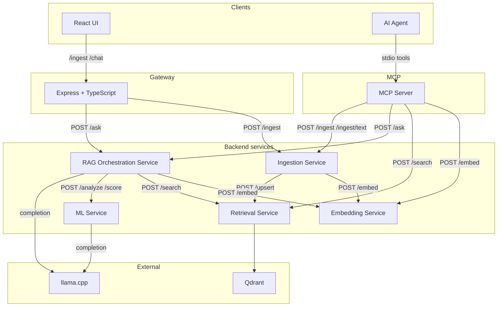
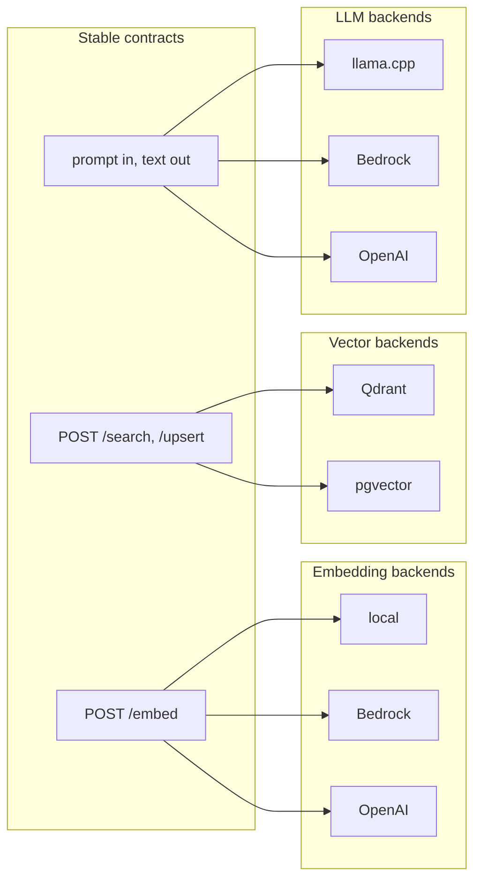

# Architecture 🏗️

## Overview 🧭

Document RAG is a local RAG (Retrieval Augmented Generation) system for document question-answering. The backend is split into **separated services** with **config-driven backends** for embeddings, vector store, and LLM. The frontend talks only to the Gateway; adding Bedrock, pgvector, or other providers is done by implementing a backend and setting config—no changes to callers. See [backends.md](backends.md) for how to add new backends.

---

## Target architecture 🎯

The frontend calls the Gateway; the Gateway proxies to Ingestion (for uploads) and RAG (for questions). Ingestion and RAG call the Embedding and Retrieval services; RAG also calls the LLM. RAG runs **input and output safeguards** inside the service: the input safeguard validates the user query before embedding/search; the output safeguard validates the LLM response before returning. Safeguards are config-driven and can be disabled or swapped (see [safeguards.md](safeguards.md)). RAG also uses an optional **reranker** (in-process module): when enabled, RAG requests more candidates from Retrieval (e.g. top 20), reranks them with a cross-encoder (e.g. BGE), then passes the top-k chunks to the LLM. Set `RERANKER_PROVIDER=none` or leave it unset to skip reranking. **AI agents** (Cursor, Claude Desktop, etc.) can use the system via the **MCP server**, which exposes RAG as tools over the Model Context Protocol without changing existing service logic.

Within the RAG service, the pipeline runs **input safeguard** (before embedding), then optional **query rewriting** (to improve retrieval), then embed → search → optional rerank → LLM, then **output safeguard** (before returning the response). Blocked requests or responses return 403. The query rewriter transforms vague queries into clearer forms for better vector search while preserving the original query for the final answer; see [query_rewriter.md](query_rewriter.md).

---

## Modular backends (config-driven) 🔌

Three areas are **modular backends**: one implementation is chosen via config; callers depend only on the stable HTTP contract. Adding Bedrock, pgvector, or another provider = new backend implementation + config, no changes to other services.

| Area | Contract (stable) | Config key | Initial backend | Future backends (examples) |
|------|-------------------|------------|------------------|----------------------------|
| **Embedding** | `POST /embed` single or batch; same request/response shape | `EMBEDDING_BACKEND` | `local` (sentence-transformers) | `bedrock`, `openai`, `cohere` |
| **Vector store** | `POST /search`, `POST /upsert`, ensure collection; same chunk shape | `VECTOR_BACKEND` | `qdrant` | `pgvector`, `pinecone` |
| **LLM** | Prompt in, text out (RAG calls one abstraction) | `LLM_BACKEND` | `llama` (llama.cpp HTTP) | `bedrock`, `openai`, `azure` |
| **Reranker** | Query + documents → top_k ranked documents (in-process, optional) | `RERANKER_PROVIDER` | `bge` (BAAI/bge-reranker-base) | `none` to disable; future: other cross-encoders |

Each owning service (Embedding, Retrieval, RAG) loads the backend from config and delegates to the matching implementation; no backend-specific code in Ingestion or Gateway. The reranker runs inside the RAG process (same pattern as LLM backends).

---

## Service boundaries and APIs 🌐

| Service | Responsibility | HTTP API | Calls |
|---------|----------------|----------|-------|
| **Gateway** | Single entry for frontend; proxy to Ingestion and RAG | `POST /ingest`, `POST /chat`, `GET /health` | Ingestion, RAG |
| **Ingestion** | PDF or text → chunks; embed via Embedding; store via Retrieval | `POST /ingest` (multipart file), `POST /ingest/text` (JSON body) → `{status, chunks_inserted, document}` | Embedding, Retrieval |
| **Embedding** | Text → vectors; **backend** = local / Bedrock / OpenAI / etc. | `POST /embed` `{text}` or `{texts}` → `{embedding}` / `{embeddings}` (contract fixed) | — |
| **Retrieval** | Vector search + upsert; **backend** = Qdrant / pgvector / etc. | `POST /search` `{query_vector, top_k}` → `{chunks}`; `POST /upsert` `{points}`; ensure collection | Selected vector store |
| **RAG** | Orchestrate: embed → search → (optional rerank) → prompt → LLM; **LLM backend** selectable; **reranker** optional; **safeguards** (input/output) configurable; **ML service** (optional) for injection detection and retrieval scoring | `POST /ask` `{question}` → `{question, answer, sources}` | Embedding, Retrieval, ML (optional), LLM (backend) |
| **ML** | LLM-based analysis: injection detection, query classification, retrieval quality scoring; optional service called by RAG | `POST /analyze` `{query, chunks?}` → `{injection, intent, retrieval_score?}`; `POST /score` `{query, chunks}` → `{score, sufficient, reason}` | LLM (backend) |
| **MCP Server** | Expose RAG as MCP tools for AI agents (thin HTTP client) | stdio (tools: search_documents, ask_rag, ingest_document) | Embedding, Retrieval, RAG, Ingestion |

Frontend continues to call the Gateway only (same paths and payloads as before). The MCP server calls backend services directly over HTTP; see [mcp.md](mcp.md) for setup and tool descriptions.

---

## Repository layout (monorepo) 🗂️

Under `backend/`:

| Path | Description |
|------|-------------|
| **`backend/shared/`** | Chunker, PDF parser, prompt-building logic; **safeguard rules** in `safeguard_constants.py`; **reranker** module; **query_rewriter** module; used by Ingestion and RAG. |
| **`backend/services/safeguard/`** | Safeguard module: base interface, `basic` provider (pattern/topic checks), factory; used by RAG. |
| **`backend/services/gateway/`** | Express + TypeScript app; routes `/ingest` and `/chat` to Ingestion and RAG via HTTP; owns its own Node build/runtime files; minimal deps. No backend logic. |
| **`backend/services/ingestion/`** | FastAPI app; PDF parse + chunk (shared); HTTP client to Embedding and Retrieval only. Callers stay backend-agnostic. |
| **`backend/services/embedding/`** | FastAPI app; **backend abstraction**: `/embed` delegates to implementation selected by `EMBEDDING_BACKEND`. Implementations: `backends/local.py`, `backends/bedrock_stub.py`; same interface (embed single/batch). |
| **`backend/services/retrieval/`** | FastAPI app; **backend abstraction**: `/search`, `/upsert`, ensure collection delegate to `VECTOR_BACKEND`. Implementations: `backends/qdrant_backend.py`, `backends/pgvector.py`. |
| **`backend/services/rag/`** | FastAPI app; HTTP clients to Embedding, Retrieval, and ML; **LLM backend abstraction** selected by `LLM_BACKEND`; implementations: `backends/llama_backend.py`, `backends/openai_backend.py`, `backends/bedrock_stub.py`. No embedding or vector store code. |
| **`backend/services/ml/`** | FastAPI app; LLM-based analysis: **injection detection**, **query classification**, **retrieval scoring**. Uses same LLM backend as RAG. See [ml_service.md](ml_service.md). |
| **`frontend/`** | Vite + React app; talks to Gateway only. |
| **`mcp_service/`** | MCP server (FastMCP): tools that call Embedding, Retrieval, RAG, and Ingestion over HTTP. See [mcp.md](mcp.md). |
| **`docs/`** | Documentation; [backends.md](backends.md) for adding new backends; [mcp.md](mcp.md) for the MCP server; [ml_service.md](ml_service.md) for the ML service; [query_rewriter.md](query_rewriter.md) for query rewriting. |

---

## Configuration per service ⚙️

| Service | Environment variables |
|---------|------------------------|
| **Gateway** | `INGESTION_URL`, `RAG_URL`, optional `PORT` (e.g. `http://ingestion:8001`, `http://rag:8004`). |
| **Ingestion** | `EMBEDDING_URL`, `RETRIEVAL_URL`, `CHUNK_SIZE`. No backend keys. |
| **Embedding** | `EMBEDDING_BACKEND=local` (default). Backend-specific: `local` → `EMBEDDING_MODEL` (e.g. `BAAI/bge-small-en-v1.5`); `bedrock` → AWS region, model ID, credentials; `openai` → API key, model. |
| **Retrieval** | `VECTOR_BACKEND=qdrant` (default). Backend-specific: `qdrant` → `QDRANT_HOST`, `QDRANT_PORT`, `COLLECTION_NAME`, `VECTOR_SIZE` (384), `TOP_K`; `pgvector` → `DATABASE_URL`, table name, vector size, top_k. |
| **RAG** | `EMBEDDING_URL`, `RETRIEVAL_URL`, `LLM_BACKEND=llama` (default), `TOP_K`. **Safeguards:** `SAFEGUARD_ENABLED=true` (default; set to `false` to disable), `SAFEGUARD_PROVIDER=basic`. **Reranker (optional):** `RERANKER_PROVIDER=bge` (default; use `none` or empty to disable), `VECTOR_SEARCH_TOP_K=20`, `RERANK_TOP_K=3`. **Query Rewriter (optional):** `QUERY_REWRITING_ENABLED=true` (default; set to `false` to disable), `QUERY_REWRITER_PROVIDER=llm`, `QUERY_REWRITER_MAX_WORDS=10`; see [query_rewriter.md](query_rewriter.md). **ML Service (optional):** `ML_SERVICE_ENABLED=false` (default; set to `true` to enable), `ML_SERVICE_URL`, `INJECTION_THRESHOLD=0.7`, `RETRIEVAL_SCORE_THRESHOLD=0.5`. LLM backend-specific: `llama` → `LLM_URL`; `bedrock` → region, model ID, credentials; `openai` → API key, model. |
| **ML** | `LLM_BACKEND=llama` (default), `LLM_URL`. Backend-specific: same as RAG. **Thresholds:** `INJECTION_THRESHOLD=0.7`, `RETRIEVAL_SCORE_THRESHOLD=0.5`. |

Each service has its own `config/settings.py` (or equivalent) loaded from env.

---

## Docker and runtime 🐳

- **docker-compose.yml**: Services `gateway` (port 8000), `ingestion` (8001), `embedding` (8002), `retrieval` (8003), `rag` (8004), `ml` (8005), plus `qdrant`. Gateway depends on ingestion and rag; ingestion depends on embedding and retrieval; rag depends on embedding, retrieval, and ml. LLM remains external (`LLM_URL` pointing to host or existing LLM container).
- **Dockerfiles**: One per service under `backend/services/<name>/Dockerfile`; build context `backend/` so shared code is available.
- **Makefile**: `make up` starts all services; `make run-gateway` runs the Node Gateway only (port 8000); `make run-backends` runs the four Python services in one terminal; `make run-embedding`, etc. run a single Python service locally for dev. To run without Docker (except Qdrant), see [Local development](local-development.md).

---

## Adding a new backend (extensibility) 🚀

To add a new provider without changing callers:

- **New embedding backend (e.g. Bedrock):** In `backend/services/embedding/`, add or implement `backends/bedrock.py` with the same interface as `local` (`embed`, `embed_batch`). Register via `EMBEDDING_BACKEND`; add backend-specific env. No changes to Ingestion or RAG.
- **New vector backend (e.g. pgvector):** In `backend/services/retrieval/`, add `backends/pgvector.py` implementing search, upsert, and ensure collection. Register under `VECTOR_BACKEND`; add `DATABASE_URL` etc. No changes to Ingestion or RAG.
- **New LLM backend (e.g. Bedrock):** In `backend/services/rag/`, add `backends/bedrock.py` implementing the LLM interface (prompt in, text out). Register under `LLM_BACKEND`; add backend-specific env. No changes to Gateway or other services.
- **New reranker backend:** The reranker is an in-process module used by RAG (see `backend/shared/reranker/`). Implement a class with `rerank(query, documents, top_k)` in `shared/reranker/`, register in `factory.py`; set `RERANKER_PROVIDER` to select it. Use `RERANKER_PROVIDER=none` to disable reranking.
- **New query rewriter provider:** The query rewriter is an in-process module used by RAG (see `backend/shared/query_rewriter/` and [query_rewriter.md](query_rewriter.md)). Implement a class with `rewrite(query)` in `shared/query_rewriter/`, register in `factory.py`; set `QUERY_REWRITER_PROVIDER` to select it. Set `QUERY_REWRITING_ENABLED=false` to disable rewriting.
- **New safeguard provider:** Safeguards run inside RAG (see `backend/services/safeguard/` and [safeguards.md](safeguards.md)). Implement a class with `validate_input(query)` and `validate_output(response)` in `services/safeguard/`, register in `factory.py`; set `SAFEGUARD_PROVIDER` to select it. Set `SAFEGUARD_ENABLED=false` to disable safeguards.

See [backends.md](backends.md) for step-by-step instructions and contracts.
