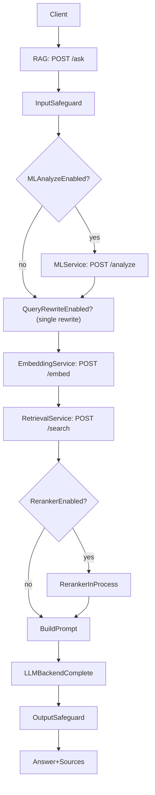
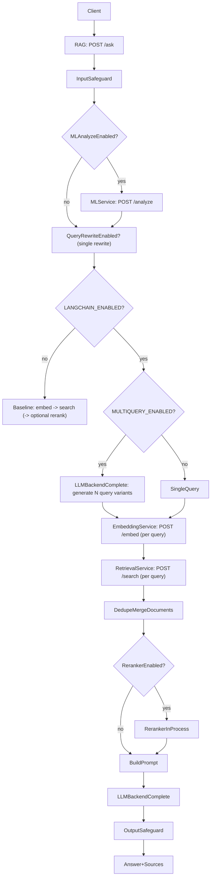

# LangChain + LangSmith (Optional)

> This integration improves retrieval recall and observability while preserving the existing service-oriented architecture and API contracts.

This repo is designed as a service-oriented RAG platform. LangChain was introduced **only inside the RAG service** as an optional, feature-flagged enhancement to retrieval orchestration (multi-query retrieval) and tracing (LangSmith), without changing service boundaries.

## What changed (and what did not)

### Changed
- The RAG service (`backend/services/rag/`) can optionally use **LangChain multi-query retrieval** to improve recall on short/vague questions.
- The RAG service can optionally emit **LangSmith traces** for `/ask` requests (and the LangChain retrieval step).

### Not changed
- Service architecture and contracts are unchanged:
  - Embedding is still `POST /embed` (Embedding service).
  - Retrieval is still `POST /search` (Retrieval service).
  - LLM calls still go through the existing pluggable backend interface (`complete(prompt)`) inside the RAG service.
- The Gateway, Ingestion service, Retrieval service, and Embedding service APIs are unchanged.

---

## Why multi-query retrieval improves results

Traditional (single-query) retrieval depends heavily on how the user phrases a question. If the wording does not match the terminology used in the indexed documents, relevant results may be missed.

Multi-query retrieval addresses this by generating multiple semantically diverse variants of the original question and executing retrieval for each variant.

For example:

- User question: "how do we handle auth?"
- Generated variants:
  - "authentication flow in the system"
  - "how login works"
  - "JWT token handling"
  - "user authorization mechanism"

Each variant explores a different phrasing or aspect of the same intent.

### Benefits

- **Improved recall**  
  More relevant documents are retrieved because multiple phrasings are explored.

- **Robustness to user wording**  
  The system no longer depends on users using the same terminology as the documents.

- **Better input for reranking**  
  A larger and more diverse candidate set improves the effectiveness of the reranker.

### Trade-offs

- **Increased latency and cost**  
  Retrieval is executed multiple times (roughly proportional to `MULTIQUERY_N`).

- **Potential noise**  
  Without deduplication and reranking, additional queries may introduce irrelevant results.

This implementation mitigates noise via:
- document deduplication/merging
- optional reranking

---

## What "retrieval quality" means in this system

In this context, retrieval quality refers to how effectively the system finds relevant documents that can support a grounded answer.

It can be evaluated along two main dimensions:

- **Recall**: Are all relevant documents retrieved?
- **Precision**: Are the retrieved documents actually relevant?

Multi-query retrieval primarily improves **recall**, while the optional reranker helps improve **precision** by selecting the most relevant results from a larger candidate pool.

---

## Where it lives (key code paths)

- RAG orchestration and feature flags:
  - `backend/services/rag/app/main.py`
  - `backend/services/rag/app/config/settings.py`
- LangChain adapters (thin wrappers around existing components):
  - `backend/services/rag/app/langchain_adapters.py`

---

## Before vs after (request flow)

### Before (baseline retrieval path)

---

### After (LangChain-enabled retrieval path)

Only the *retrieval orchestration* changes when `LANGCHAIN_ENABLED=true`. Everything outside retrieval (safeguards, optional ML, prompt building, LLM completion) remains the same.

---

## Configuration (env flags)

All values live in the repo root `.env` (for local/dev) and are documented in `.env.example`.

- **Enable/disable LangChain retrieval path**
  - `LANGCHAIN_ENABLED=true|false`

- **Multi-query retrieval**
  - `MULTIQUERY_ENABLED=true|false`
  - `MULTIQUERY_N=4` (typical range: 3–5)

- **Candidate depth (pre-rerank)**
  - `LANGCHAIN_RETRIEVER_TOP_K=20` (optional)

- **LangSmith tracing (optional)**
  - `LANGSMITH_TRACING=true|false`
  - `LANGCHAIN_API_KEY=...`
  - `LANGCHAIN_PROJECT=document_rag`
  - `LANGCHAIN_ENDPOINT=...`

---

## How to compare before vs after

Recommended A/B procedure:

- Use a fixed test set (10–30 questions)
- Keep all other parameters constant

Run:
- `LANGCHAIN_ENABLED=false`
- `LANGCHAIN_ENABLED=true`

### Compare:

- **Grounding**
  - Do retrieved `sources` contain correct documents?
  - Are key docs missing in baseline but present with multi-query?

- **Answer quality**
  - Fewer “I can’t find it” responses?
  - Reduced hallucinations?

- **Retrieval coverage**
  - Does multi-query surface additional relevant chunks?

- **Latency**
  - Measure increase (~N× retrieval calls)

- **Cost**
  - Additional embedding + search calls

---

## When to use multi-query retrieval

Best for:
- Short / vague queries
- Non-expert users
- Synonym-heavy domains

Less useful for:
- Long, precise queries
- Queries already matching document wording

---

## Design note

LangChain is intentionally used only as an internal orchestration layer within the RAG service.

The system avoids tight coupling by:
- keeping all service contracts unchanged
- using thin adapter layers
- guarding behavior behind feature flags

This ensures:
- safe experimentation
- easy rollback
- no framework lock-in

---

## When LangSmith still helps with LangChain off

Even with `LANGCHAIN_ENABLED=false`:

- You can trace `/ask` requests
- Debug prompt + retrieval behavior
- Instrument steps incrementally with `@traceable(...)`