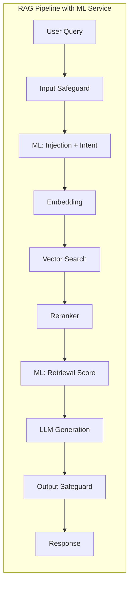

# ML Service 🧠

The ML Service provides LLM-based analysis for the RAG pipeline, including prompt injection detection, query intent classification, and retrieval quality scoring.

---

## Overview 🧭

The ML Service is an optional component that enhances the RAG pipeline with additional security and quality checks:



---

## Components 🧩

### 1. Injection Detector

Detects prompt injection attempts using LLM-based classification.

**What it detects:**
- Instructions to ignore previous prompts
- Attempts to override system behavior
- Hidden instructions in markdown/code blocks
- Role-playing scenarios to bypass restrictions
- System prompt extraction attempts

**Response format:**
```json
{
  "is_injection": false,
  "confidence": 0.1,
  "reason": "Normal question about documents"
}
```

### 2. Query Classifier

Classifies query intent into categories:

| Intent | Description | Examples |
|--------|-------------|----------|
| `question` | Asking for information | "What is X?", "How does Y work?" |
| `command` | Requesting an action | "Delete this file", "Run the test" |
| `search` | Looking for specific content | "Find all Python files", "Show me X" |
| `clarification` | Asking for more details | "What do you mean?", "Can you explain?" |
| `other` | Doesn't fit above categories | Greetings, off-topic |

**Response format:**
```json
{
  "intent": "question",
  "confidence": 0.95
}
```

### 3. Retrieval Scorer

Evaluates the quality of retrieved chunks after reranking.

**Evaluation criteria:**
- **Relevance**: Do chunks relate to the query?
- **Completeness**: Is there enough information to answer?
- **Quality**: Is the information clear and useful?

**Response format:**
```json
{
  "score": 0.85,
  "sufficient": true,
  "reason": "Chunks directly address the user's question"
}
```

**Score guidelines:**
| Score Range | Interpretation |
|-------------|----------------|
| 0.0 - 0.3 | Irrelevant or unhelpful |
| 0.3 - 0.6 | Partially relevant, may need more context |
| 0.6 - 0.8 | Good relevance, can likely answer |
| 0.8 - 1.0 | Excellent match, directly addresses query |

---

## API Endpoints 🌐

### POST /analyze

Full analysis: injection detection + query classification + optional retrieval scoring.

**Request:**
```json
{
  "query": "What is Python?",
  "chunks": [
    {"text": "Python is a programming language.", "source": "doc1.pdf"}
  ]
}
```

**Response:**
```json
{
  "injection": {
    "is_injection": false,
    "confidence": 0.1,
    "reason": "Normal question"
  },
  "intent": {
    "intent": "question",
    "confidence": 0.95
  },
  "retrieval_score": {
    "score": 0.9,
    "sufficient": true,
    "reason": "Chunks directly address Python"
  }
}
```

### POST /score

Retrieval scoring only (called after reranking).

**Request:**
```json
{
  "query": "What is Python?",
  "chunks": [
    {"text": "Python is a programming language.", "source": "doc1.pdf"}
  ]
}
```

**Response:**
```json
{
  "score": 0.9,
  "sufficient": true,
  "reason": "Chunks directly address the query"
}
```

### GET /health

Health check endpoint.

**Response:**
```json
{"status": "ok"}
```

---

## Configuration ⚙️

| Variable | Default | Description |
|----------|---------|-------------|
| `LLM_BACKEND` | `llama` | LLM backend: `llama`, `openai`, `bedrock` |
| `LLM_URL` | `http://localhost:8080` | URL for llama.cpp server |
| `OPENAI_API_KEY` | — | OpenAI API key (for `openai` backend) |
| `OPENAI_MODEL` | `gpt-4o-mini` | OpenAI model name |
| `INJECTION_THRESHOLD` | `0.7` | Confidence threshold to block injections |
| `RETRIEVAL_SCORE_THRESHOLD` | `0.5` | Minimum retrieval quality score |
| `ML_SERVICE_PORT` | `8005` | Service port |

---

## RAG Integration 🔗

Enable the ML Service in RAG by setting:

```bash
ML_SERVICE_ENABLED=true
ML_SERVICE_URL=http://ml:8005
```

### Pipeline Flow with ML Service

1. **Input Safeguard** — Pattern-based blocking (fast, rule-based)
2. **Injection Detection** — LLM-based analysis (slower, more thorough)
3. **Query Classification** — Intent logging for metrics
4. **Embedding + Search + Rerank** — Standard RAG flow
5. **Retrieval Scoring** — Quality check before LLM call
6. **LLM Generation** — Generate answer
7. **Output Safeguard** — Pattern-based response validation

### Failure Handling

If the ML Service is unavailable:
- RAG continues without ML analysis (graceful degradation)
- Warning logged: "ML service unavailable, continuing without"
- No 5xx errors propagated to users

---

## Running Locally 💻

### With Docker

```bash
# Start all services including ML
docker-compose up

# Or start ML service only
docker-compose up ml
```

### Without Docker

```bash
cd backend
PYTHONPATH=. uvicorn services.ml.app.main:app --port 8005
```

---

## Testing 🧪

Run ML service tests:

```bash
cd backend
pytest tests/test_ml_service.py -v
```

Test categories:
- Injection detection (clean queries, malicious queries, edge cases)
- Query classification (all intent types)
- Retrieval scoring (high/low quality, empty chunks)
- Error handling (LLM failures, invalid JSON)

---

## Extensibility 🔌

### Adding a New Classifier

1. Create a new component in `backend/services/ml/app/components/`:

```python
from .base import BaseQueryClassifier, IntentResult

class CustomClassifier(BaseQueryClassifier):
    def classify(self, query: str) -> IntentResult:
        # Your classification logic
        return IntentResult(intent="custom", confidence=0.9)
```

2. Register in factory:

```python
# In factory.py
def get_query_classifier():
    provider = os.getenv("QUERY_CLASSIFIER_PROVIDER", "llm")
    if provider == "custom":
        return CustomClassifier()
    # ... existing logic
```

### Adding a Non-LLM Injection Detector

For faster detection without LLM calls:

```python
from .base import BaseInjectionDetector, InjectionResult

class PatternInjectionDetector(BaseInjectionDetector):
    PATTERNS = ["ignore previous", "you are now", "pretend you"]
    
    def detect(self, query: str) -> InjectionResult:
        query_lower = query.lower()
        for pattern in self.PATTERNS:
            if pattern in query_lower:
                return InjectionResult(
                    is_injection=True,
                    confidence=0.9,
                    reason=f"Matched pattern: {pattern}"
                )
        return InjectionResult(is_injection=False, confidence=0.1, reason="No patterns matched")
```

---

## Performance Considerations

- **Latency**: Each ML component adds ~100-500ms (LLM-based)
- **Parallelization**: Injection detection and classification run sequentially; consider parallel execution for lower latency
- **Caching**: Consider caching injection detection results for repeated queries
- **Disabling**: Set `ML_SERVICE_ENABLED=false` to skip ML analysis entirely

---

## See Also

- [architecture.md](architecture.md) — Overall system architecture
- [backends.md](backends.md) — Adding new LLM backends
- [safeguards.md](safeguards.md) — Pattern-based safeguards (non-ML)
