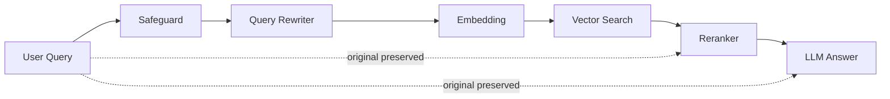

# Query Rewriter ✏️

## Overview 🧭

The Query Rewriter is an optional component in the RAG pipeline that transforms vague or poorly structured user queries into clearer, more descriptive queries before vector search. This improves embedding quality and document retrieval accuracy.

**Example transformation:**

| Original Query | Rewritten Query |
|----------------|-----------------|
| "k8s pod scheduling?" | "How does Kubernetes schedule pods to nodes?" |
| "python async" | "How does asynchronous programming work in Python?" |
| "cv experience" | "What work experience is listed in the CV or resume?" |

The rewritten query is **only used for retrieval** (embedding and vector search). The **original query is preserved** for the final LLM answer, reranking, and response.

---

## Architecture 🏗️



The Query Rewriter sits between the Safeguard and Embedding steps. It uses the same LLM backend as the RAG service to rewrite queries.

---

## Configuration ⚙️

| Environment Variable | Default | Description |
|---------------------|---------|-------------|
| `QUERY_REWRITING_ENABLED` | `true` | Enable/disable query rewriting |
| `QUERY_REWRITER_PROVIDER` | `llm` | Provider to use (currently only `llm`) |
| `QUERY_REWRITER_MAX_WORDS` | `10` | Skip rewriting if query exceeds this word count |

### .env Example

```bash
# Query Rewriter
QUERY_REWRITING_ENABLED=true
QUERY_REWRITER_PROVIDER=llm
QUERY_REWRITER_MAX_WORDS=10
```

### Disabling Query Rewriting

Set `QUERY_REWRITING_ENABLED=false` to disable query rewriting entirely. This is useful for:
- Debugging retrieval issues
- Comparing retrieval quality with/without rewriting
- Reducing latency when queries are already well-formed

---

## Module Structure 🧩

```
backend/shared/query_rewriter/
├── __init__.py       # Package exports
├── base.py           # Abstract base class
├── llm_rewriter.py   # LLM-based implementation
└── factory.py        # Singleton factory
```

### Base Interface

```python
class BaseQueryRewriter(ABC):
    @abstractmethod
    def rewrite(self, query: str) -> str:
        """Rewrite a user query into a clearer form for retrieval."""
        ...
```

### LLM Rewriter

The `LLMQueryRewriter` uses the configured LLM backend to rewrite queries:

1. **Safety check**: Queries with more than `QUERY_REWRITER_MAX_WORDS` words are returned unchanged (already descriptive)
2. **LLM prompt**: Sends a structured prompt asking the LLM to clarify and expand the query
3. **Fallback**: If rewriting fails, returns the original query

---

## How It Works 🔍

### Pipeline Flow

1. User submits query: `"cv skills python"`
2. Safeguard validates input
3. **Query Rewriter** transforms to: `"What Python programming skills are listed in the CV or resume?"`
4. Embedding service embeds the **rewritten** query
5. Vector search finds relevant chunks
6. Reranker scores chunks against **original** query
7. LLM generates answer using **original** query + context
8. Response includes **original** query

### Why Preserve Original Query?

- **Reranker**: Uses original query for accurate relevance scoring
- **LLM Prompt**: User's exact wording provides context for the answer
- **Response**: Returns what the user asked, not a rewritten version
- **Logging**: Both queries are logged for debugging

---

## Logging 📓

Both original and rewritten queries are logged for observability:

```
INFO - Query rewritten: original='cv skills python', rewritten='What Python programming skills are listed in the CV or resume?'
```

This helps debug retrieval issues by comparing what was searched vs. what was asked.

---

## Adding a New Rewriter Provider 🔌

To add a custom query rewriter:

1. Create a new class in `backend/shared/query_rewriter/` implementing `BaseQueryRewriter`
2. Register it in `factory.py`:

```python
if provider == "my_provider":
    _rewriter_instance = MyCustomRewriter(...)
```

3. Set `QUERY_REWRITER_PROVIDER=my_provider` in your environment

---

## Test Cases 🧪

### CV/Resume Queries

If you've uploaded a CV/resume, test these queries:

| Original Query | Expected Rewrite | What to Verify |
|----------------|------------------|----------------|
| `"cv experience"` | "What work experience is listed in the CV?" | Returns job history |
| `"skills python"` | "What Python skills or experience are mentioned?" | Lists Python-related skills |
| `"education"` | "What educational background or degrees are listed?" | Returns education section |
| `"contact info"` | "What contact information is provided in the document?" | Returns email, phone, etc. |
| `"projects"` | "What projects are described in the CV or resume?" | Lists notable projects |

### Technical Queries

| Original Query | Expected Rewrite |
|----------------|------------------|
| `"k8s pods"` | "How do Kubernetes pods work?" |
| `"docker compose"` | "How does Docker Compose work for container orchestration?" |
| `"async await js"` | "How do async and await work in JavaScript?" |
| `"sql joins"` | "How do SQL JOIN operations work?" |

### Short vs. Long Queries

| Query | Behavior |
|-------|----------|
| `"python"` (1 word) | Rewritten for clarity |
| `"experience with python"` (3 words) | Rewritten for clarity |
| `"What is your experience with Python programming and machine learning projects?"` (11+ words) | Skipped (already descriptive) |

---

## Troubleshooting 🛠️

### Query Not Being Rewritten

1. Check `QUERY_REWRITING_ENABLED=true`
2. Verify query has ≤10 words (configurable via `QUERY_REWRITER_MAX_WORDS`)
3. Check logs for rewriting errors

### Poor Retrieval Despite Rewriting

1. Compare original vs. rewritten query in logs
2. Try disabling rewriting to compare results
3. Check if rewritten query is too different from original intent

### Latency Concerns

Query rewriting adds one LLM call. To reduce latency:
- Use a faster LLM backend
- Increase `QUERY_REWRITER_MAX_WORDS` to skip more queries
- Disable rewriting for well-formed queries via `QUERY_REWRITING_ENABLED=false`
